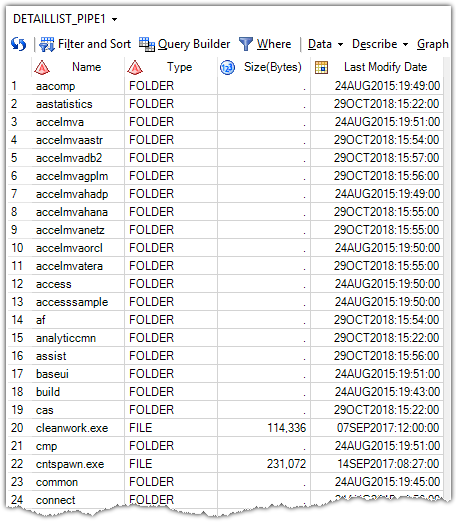
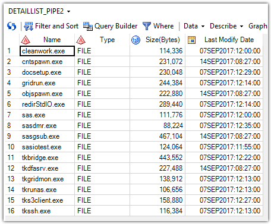
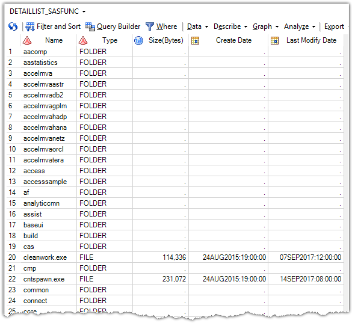
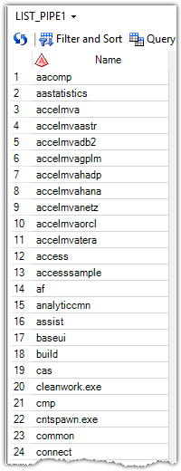
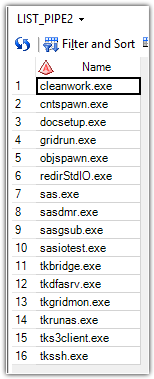
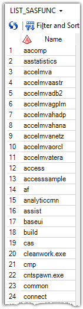

# 1. GetFolderDetailListWithPipe.sas

This macro can retrieve the detail list of files and folders under a directory through the unnamed pipe. The output data set contains 4 column. This macro has two parameters:
- PATH=: The full path of a directory, or a full path with wildcards of a directory.
- OUT_DSN=: The name of output dataset.

**Here is some examples**:

%GetFolderDetailListWithPipe(path=D:\Program Files\SASHome\SASFoundation\9.4, out_dsn=work.detaillist_pipe1)

%GetFolderDetailListWithPipe(path=D:\Program Files\SASHome\SASFoundation\9.4\\*.exe, out_dsn=work.detaillist_pipe2)

---

# 2. GetFolderDetailListWithSASFunc.sas

This macro can also retrieve the detail list of files and folders under a directory, but it uses the SAS functions. The output data set contains 5 column, one more Create_Date for file. But this macro can **only run correctly on the Windows platform**, because the process of get the file attributes is for Windows OS specifically.It also contains two parameters:

- PATH=: Can only be the full path of a directory, doesn't support the wildcards.
- OUT_DSN=: The name of output dataset.

**Here is an examples**:

%GetFolderDetailListWithSASFunc(path=D:\Program Files\SASHome\SASFoundation\9.4, out_dsn=work.detaillist_sasfunc)

---

# 3. GetFolderListWithPipe.sas

This macro can only retrieve the list of file and folder name, no additional information. You can't completely separate folders and files unless you specify a file wildcard. Thus, you can get the file list. The output dataset only contains 1 column for the name of file or folder.

**Here is some example**:

%GetFolderListWithPipe(path=D:\Program Files\SASHome\SASFoundation\9.4, out_dsn=work.list_pipe1)

%GetFolderListWithPipe(path=D:\Program Files\SASHome\SASFoundation\\9.4\*.exe, out_dsn=work.list_pipe2)

---

# 4. GetFolderListWithSASFunc.sas

This macro also can only retrieve the list of file and folder name, no additional information. The output dataset only contains 1 column for the name of file or folder.

**Here is some example**:

%GetFolderListWithSASFunc(path=D:\Program Files\SASHome\SASFoundation\9.4, out_dsn=work.list_sasfunc)

---

# 5. GetFtpDetailList.sas

wait...

---

# 6. GetFtpFileList.sas

