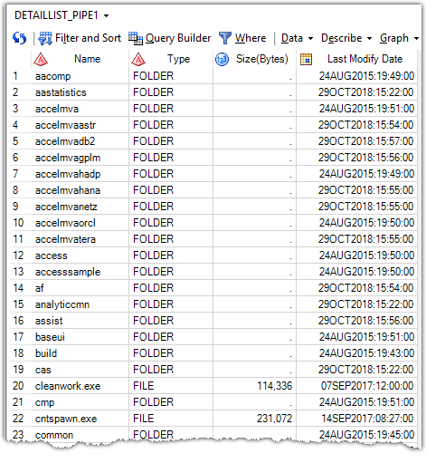
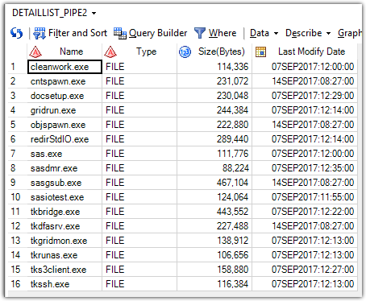

# 1. GetFolderDetailListWithPipe.sas

This macro can retrieve the detail list of files and folders under a directory through the unnamed pipe. The output data set contains 4 column. This macro has two parameters:
- PATH=: The full path of a directory, or a full path with wildcards of a directory.
- OUT_DSN=: The name of output dataset.

Here is an example:

%GetFolderDetailListWithPipe(path=D:\Program Files\SASHome\SASFoundation\9.4, out_dsn=work.detaillist_pipe1)

%GetFolderDetailListWithPipe(path=D:\Program Files\SASHome\SASFoundation\9.4\*.exe, out_dsn=work.detaillist_pipe2)

---

# 2. GetFolderDetailListWithSASFunc.sas

